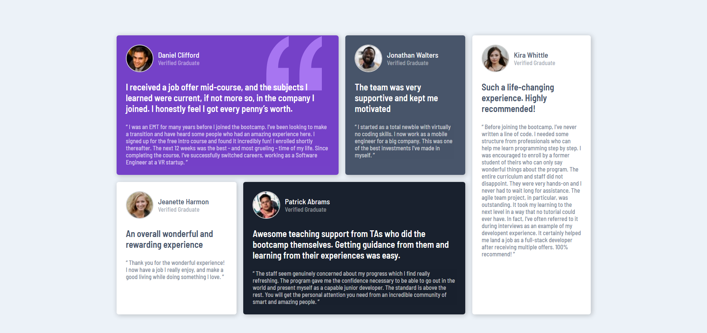

# Frontend Mentor - Testimonials grid section solution

This is a solution to the [Testimonials grid section challenge on Frontend Mentor](https://www.frontendmentor.io/challenges/testimonials-grid-section-Nnw6J7Un7). Frontend Mentor challenges help you improve your coding skills by building realistic projects. 

## Table of contents

- [Overview](#overview)
  - [The challenge](#the-challenge)
  - [Screenshot](#screenshot)
  - [Links](#links)
- [My process](#my-process)
  - [Built with](#built-with)
  - [What I learned](#what-i-learned)
  - [Continued development](#continued-development)
  - [Useful resources](#useful-resources)
- [Author](#author)
- [Acknowledgments](#acknowledgments)

## Overview

### The challenge

Users should be able to:

- View the optimal layout for the site depending on their device's screen size

### Screenshot

Mobile and Desktop screenshots:

- Desktop screenshot:

- Mobile screenshot:

### Links

- Solution URL: [Add solution URL here](https://your-solution-url.com)
- Live Site URL: [Add live site URL here](https://your-live-site-url.com)

## My process

### Built with

- Semantic HTML5 markup
- CSS custom properties
- Flexbox
- Mobile-first workflow

### What I learned

Practice with CSS FlexBox.

### Continued development

Using CSS Grid.

### Useful resources

- [Zach Gollwitzer](https://www.youtube.com/@zachgoll/videos) - Great tutorials about FlexBox and others tutorials.

## Author

- Frontend Mentor - [@viorel7774](https://www.frontendmentor.io/profile/viorel7774)

## Acknowledgments

Thanks to [Zach Gollwitzer](https://www.youtube.com/@zachgoll/videos) - I have inspired from his youtube channel about this project. Learn a a lot from there.
